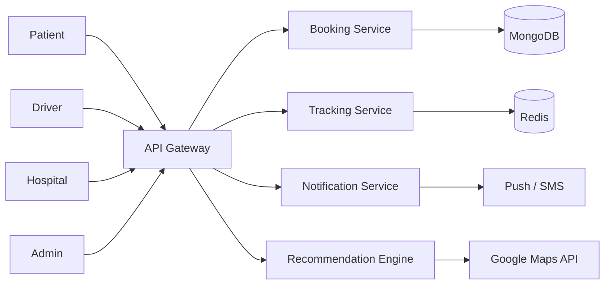
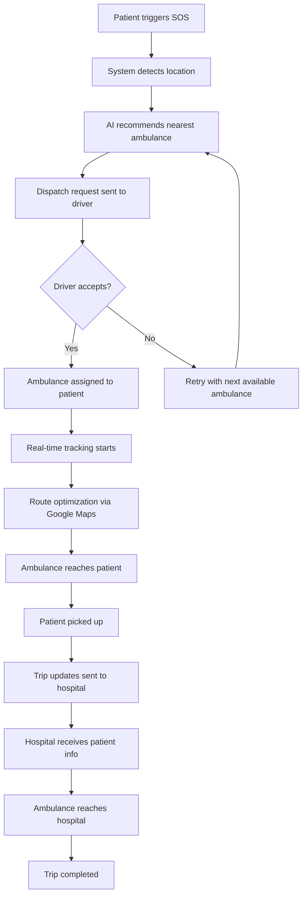
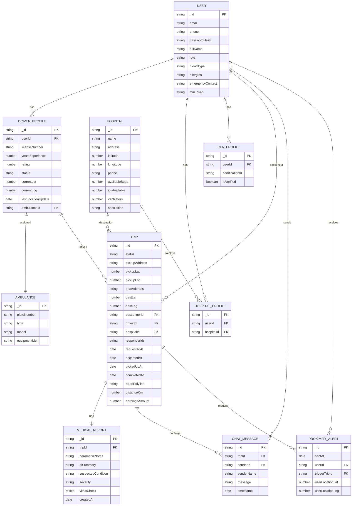

# AmbuSOS 🚑

> Optimized emergency response platform for fast ambulance booking, live tracking, and hospital coordination.

  
  

## Overview

AmbuSOS connects patients, drivers, hospitals, and admins in a real-time emergency dispatch system. It supports SOS requests, GPS-based location detection, ambulance matching, live tracking, route optimization, and hospital handoff.

## Tech Stack

- Frontend: React, Tailwind CSS
- Backend: Node.js, Express, Socket.IO
- Database: MongoDB, Mongoose
- Intelligence: OSRM, Gemini API
- Security: JWT authentication, role-based access
- Real-time: WebSocket-based tracking and notifications

## Key Features

- Emergency ambulance request with automatic location detection
- AI-based ambulance recommendation using distance, availability, traffic, and hospital preference
- Live driver tracking and ETA updates
- Hospital dashboard for incoming patient coordination
- Admin dashboard for ambulance, driver, and hospital management
- SOS notifications, emergency contacts, and push notifications
- Medical history sharing with consent

## High-Level Architecture

- Client layer: patient app, driver app, hospital dashboard, admin portal
- Service layer: authentication, booking, dispatch, tracking, recommendation, notification
- Data layer: MongoDB for core data, Redis for caching, Kafka for events
- External integrations: Google Maps APIs, Firebase/APNs, SMS, hospital systems

## System Architecture

## Workflow

## Data Model

> Note: `Trip.responderIds` is an array of string IDs rather than a direct Mongoose ref.

## Local Setup

1. Refer to the environment documentation in the repository and add the required variables to the backend `.env` file.
2. Install dependencies for the frontend and backend.
3. Start the backend server and frontend app.
4. Seed the system using `POST /dev/seed-system`.
5. Reset the database using `DELETE /dev/reset-system` when needed.

## Contact

Email: [sparsh.agarwal0508@gmail.com](mailto:sparsh.agarwal0508@gmail.com)
